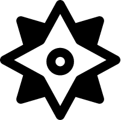

 
# Submarine Simulator
An asteroids inspired game written in C++ with SFML. Group project in DAT220 at University of Agder, Grimstad.

## Libraries and Tools

[SFML](https://www.sfml-dev.org/)

## Contributors

Aleksandar Corovic  
Anders Gouchbar  
Gaute Faklvev Homme  
Kristoffer André Myhren  
Vien Bao Ngo  
Hao Nhien Vu
